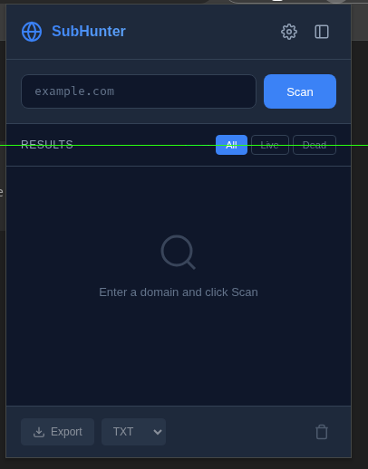
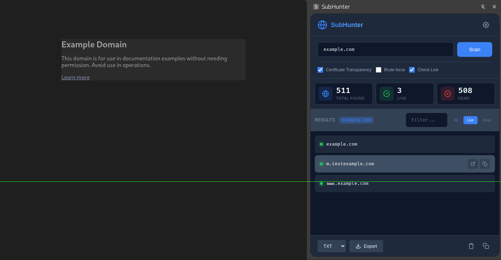

# SubHunter

A powerful, free Chrome extension for subdomain enumeration and discovery. SubHunter helps security researchers and penetration testers discover subdomains through Certificate Transparency logs, DNS brute-force, and verify live hosts.


## Features

- **Certificate Transparency Discovery**
  - crt.sh integration for comprehensive certificate log scanning
  - Certspotter API for passive DNS enumeration
  - Subdomain Center API for additional coverage

- **DNS Brute-force**
  - Built-in wordlist with 600+ common subdomain patterns
  - Configurable wordlist sizes (50-1000 entries)
  - Adjustable concurrency for faster scanning

- **Live Status Verification**
  - DNS-over-HTTPS (DoH) validation via Google DNS
  - Real-time status checking for discovered subdomains
  - Visual distinction between live and dead hosts

- **Export Options**
  - Export to TXT (plain text list)
  - Export to JSON (with metadata)
  - Export to CSV (spreadsheet-compatible)

 - **Modern UI**
  - Side panel for detailed scanning sessions
  - Quick popup for fast scans
  - Dark theme optimized for extended use
  - Real-time progress tracking

## Screenshots

### Popup View
Quick subdomain scanning directly from your browser toolbar.



### Side Panel View
Full-featured scanning interface with advanced options.



> **Note:** Add your own screenshots to the `screenshots/` directory as `popup.png` and `sidepanel.png`

## Installation

### From Source

1. Clone or download this repository
2. Open Chrome and navigate to `chrome://extensions/`
3. Enable "Developer mode" (toggle in top-right corner)
4. Click "Load unpacked"
5. Select the `SubHunter` directory

### Chrome Web Store

> Coming soon

## Usage

### Quick Scan (Popup)

1. Click the SubHunter icon in your browser toolbar
2. Enter a domain (e.g., `example.com`)
3. Click "Scan" or press Enter
4. View results in the popup

### Full Scan (Side Panel)

1. Click the SubHunter icon
2. Click the side panel icon (rectangle with divider)
3. Configure scan options:
   - **Certificate Transparency**: Query CT logs (recommended)
   - **Brute-force**: Try common subdomain names
   - **Check Live**: Verify host responsiveness
4. Click "Scan" to begin

### Settings

Access settings via the gear icon to configure:
- Discovery methods (CT logs, brute-force)
- Brute-force wordlist size and concurrency
- Default export format

## API Sources

SubHunter uses the following free APIs:

| Source | Description | Rate Limits |
|--------|-------------|-------------|
| [crt.sh](https://crt.sh/) | Certificate Transparency logs | ~60 requests/min |
| [Certspotter](https://api.certspotter.com/) | Passive certificate DB | ~120 requests/hour |
| [Subdomain Center](https://api.subdomain.center/) | Aggregated DNS data | ~60 requests/min |
| [Google DNS](https://dns.google/) | Live status verification | ~1000 requests/day |

## Permissions

| Permission | Purpose |
|------------|---------|
| `storage` | Save scan results and settings |
| `activeTab` | Access current tab for side panel |
| `tabs` | Manage browser tabs |
| `sidePanel` | Display side panel UI |

## Scanning Options

### Certificate Transparency (Recommended)
- Queries public CT logs for issued certificates
- Finds subdomains that have had valid SSL/TLS certs
- No active traffic to target servers
- Best for discovering forgotten/forgotten subdomains

### DNS Brute-force
- Tests common subdomain names against target
- Uses built-in wordlist of common patterns
- Active DNS queries (visible to resolvers)
- Good for finding predictable subdomains

### Live Status Check
- Uses DNS-over-HTTPS to verify A records
- Requires valid DNS resolution
- Marks subdomains with active web servers
- May miss subdomains behind firewalls

## Export Formats

### TXT (Plain Text)
```
subdomain1.example.com
subdomain2.example.com
```

### JSON
```json
{
  "domain": "example.com",
  "scanDate": "2024-01-15T10:30:00.000Z",
  "filter": "all",
  "totalFound": 25,
  "liveCount": 18,
  "exportedCount": 25,
  "subdomains": [...]
}
```

### CSV
```csv
subdomain,live
subdomain1.example.com,true
subdomain2.example.com,false
```

## Browser Compatibility

- Google Chrome 114+
- Microsoft Edge 114+
- Brave 1.50+
- Other Chromium-based browsers

## Contributing

Contributions are welcome! Please:

1. Fork the repository
2. Create a feature branch
3. Make your changes
4. Submit a pull request

## Disclaimer

**This tool is for authorized security testing and educational purposes only.**

- Always obtain written permission before scanning any domain you don't own
- Ensure compliance with applicable laws and regulations
- The authors are not responsible for misuse of this tool

## License

MIT License - See [LICENSE](LICENSE) for details.

## Support

- Report bugs via GitHub Issues
- Feature requests welcome
- Pull requests accepted

---

Made with security research in mind
